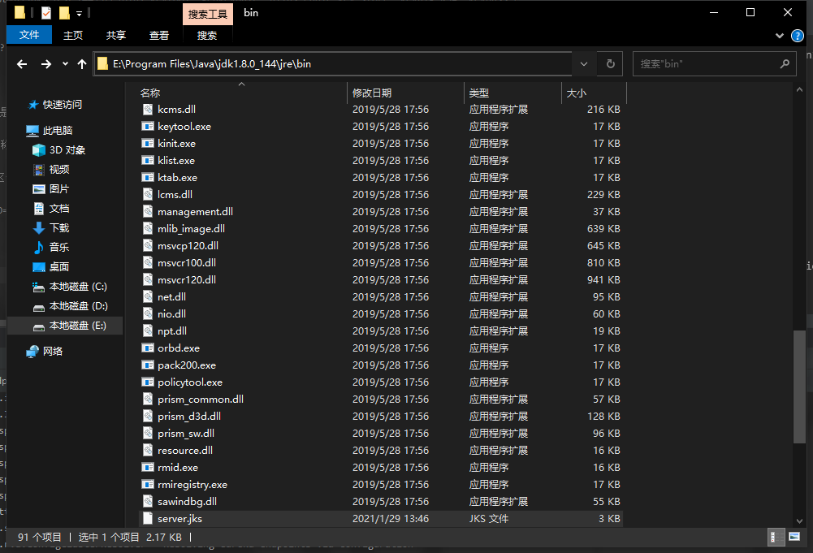
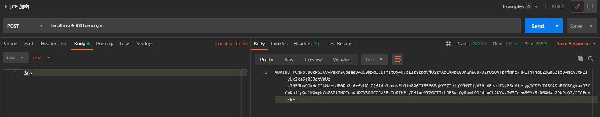
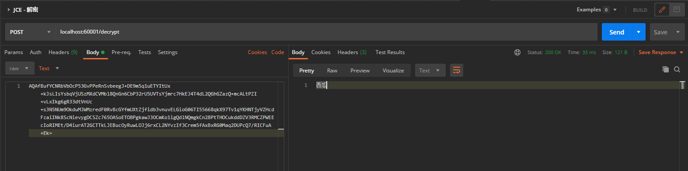
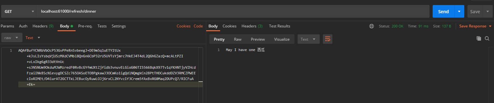

[TOC]

# 前言

## 1-1 本章概述

- 配置中心介绍, 在微服务中的应用
- Config核心功能和应用
- 直连式架构模式
  - GitHub准备
  - 搭建config-server应用
  - 应用方直连配置中心
- 参数动态刷新机制 + Github
- 思考-高可用性能分析
  - 单节点崩溃了，高可用改造方向
  - 借助Eureka实现高可用配置中心架构
  
## 1-2 配置中心在微服务中的应用

### 常规的配置定义

```xml
配置项定义
    -> 程序Hardcode
    -> 配置文件
        -> application.yml
        -> bootstrap.yml
    -> 环境变量
        -> 操作系统层面
        -> 启动参数, 如 verbose:gc
    -> 数据库存储
    -> 高可用
    -> 版本控制
        -> 修改记录
        -> 版本控制, 权限控制
    -> 业务需求
        -> 动态推送变更
        -> 内容加密
```

### 传统配置管理的缺点

格式不统一
- json
- properties
- yml

没有版本控制
- 想改就改

基于静态配置
- 修改, 发布, 流程繁琐

发布零散
- 没有统一管理

### 配置项的静态内容

静态配置
- 环境配置：数据库连接串, Eureka注册中心, Kafka连接, 应用名称
- 安全配置：连接密码, 公钥私钥, HTTP连接Cert

### 配置项的动态内容

动态配置
- 功能控制：功能开关, 人工熔断开关, 蓝绿发布(金丝雀测试), 数据源切换
- 业务规则：当日外汇利率, 动态文案, 规则引擎参数
- 应用参数： 网关黑白名单, 缓存过期时间, 日志MDC设置


## 1-5 准备工作 - Git Repo中的配置文件命名规则 

### 创建GitHub配置仓库

- 创建[Github](https://github.com/eddie-code/springcloud-demo-dec/tree/develop)仓库
- 文件命名规则（文件名可不能随便起）
- 添加配置文件和属性

### 文件命名规则

- Application & Profile
  - {application}-{profile}.yml
  - {application}-{profile}.properties
  
- Label - 代码分支的名称

## 1-6 搭建配置中心Config-Server

### 搭建配置中心

- 创建config-server项目引入依赖
- 添加参数和启动类
- 通过GET请求拉取文件（URL的几种Pattern）

#### 创建config-server项目引入依赖

```xml
<dependencies>
    <dependency>
        <groupId>org.springframework.cloud</groupId>
        <artifactId>spring-cloud-config-server</artifactId>
    </dependency>
</dependencies>
```

#### 启动类

```java
@EnableConfigServer
@SpringBootApplication
public class ConfigServerApplication {

	public static void main(String[] args) {
		new SpringApplicationBuilder(ConfigServerApplication.class)
				.web(WebApplicationType.SERVLET)
				.run(args);
	}
}
```

#### 添加参数
application.yml
```yaml
spring:
  application:
    name: config-server
  cloud:
    config:
      server:
        git:
          uri: https://github.com/eddie-code/springcloud-demo-dec.git
          search-paths: config-repo  # 如果一个仓库存放多个定义了不同名称的文件夹，再到里面的配置文件*.yml (多个情况下逗号分隔，也支持通配符*号)
          force-pull: true  # 强制拉取资源文件
          default-label: develop # 指定存放配置的分支名称
#          username: eddie-code
#          password: ******

server:
  port: 60000

```

#### 通过GET请求拉取文件（URL的几种Pattern）

```xml
Github之前创建的文件：
springcloud-demo-dec/config-repo/config-consumer-dev.yml

使用PostMan请求：
GET localhost:60000/config-consumer/dev
GET localhost:60000/config-consumer/dev/develop

控制台会打印：
    Adding property source: file:/C:/Users/ADMINI~1/AppData/Local/Temp/config-repo-7782002141354066613/config-repo/config-consumer-dev.yml

意思是已经把配置文件存放在本地
```

不同的结尾格式返回不同的参数格式：
```xml
GET localhost:60000/config-consumer-dev.yml

info:
  profile: dev
name: Eddie
words: God bless me

----

GET localhost:60000/config-consumer-dev.properties

info.profile: dev
name: Eddie
words: God bless me

---

GET localhost:60000/config-consumer-dev.json

{
    "info": {
        "profile": "dev"
    },
    "name": "Eddie",
    "words": "God bless me"
}

---

指定分支名称
GET localhost:60000/develop/config-consumer-dev.json

```

> 如若提示： "message": "No such label: master" 请添加对应的分支名称, 可在config-server配置文件或者请求时候添加


## 1-15 使用对称性密钥进行加解密-1

### 使用密钥对称加密

- JDK中替换JCE
- 改造config-server并生成加密字符串
- 修改GitHub文件, 启动服务拉取配置
  

1. 不限长度的JCE组件组件下载 (注意下载对应JDK版本的组件)
1. 官网地址：https://www.oracle.com/technetwork/cn/java/javase/downloads/jce8-download-2133166-zhs.html
   1. 如若下载不了可以 百度云盘下载 链接：https://pan.baidu.com/s/1cG-XJCCJCII_UZ7qfwNG2A  提取码：vav1
1. 解压 jce_policy-8.zip
1. Windows版本 替换 E:\Program Files\Java\jdk1.8.0_144\jre\lib\security 中的  local_policy.jar 与  US_export_policy.jar

### 创建一个 config-server-eureka 项目

- 加入 eureka 客户端服务发现
- bootstrap.yml 添加 encrypt.key=20210127 【加密解密所使用的key】

### 启动尝试

1. EurekaServerApplication :20000/
1. ConfigServerEurekaApplication :60001/
1. GET localhost:60001/encrypt/status  返回 { "status": "OK" }

## 1-16 使用对称性密钥进行加解密-2 

### 加密

```xml
POST localhost:60001/encrypt

Body --> Test --> 输出自定义的值, 比如KFC  【支持中文】 

返回： d2ac7be4356bc2b56523740a19743d95cef12ca034b77a804aaa49b8a3094b9b

每次请求的返回值都不一样的
```

### 解密

```xml
POST localhost:60001/decrypt

Body --> Test --> d2ac7be4356bc2b56523740a19743d95cef12ca034b77a804aaa49b8a3094b9b

返回加密时的值
```

### 启动服务测试

1. 在 Github 修改 config-repo/config-consumer-prod.yml
1. 修改 config-repo/config-client 追加 food: '{cipher}123fad4ddc8ad7f3a1a2f3d32c97ae429e3747094f1de744500a4a7d4403eaa6'
1. 启动服务
    1. EurekaServerApplication :20000/
    1. ConfigServerEurekaApplication :60001/
    1. ConfigClientApplication :61000/
1. 请求 GET http://localhost:60001/develop/config-consumer-prod.yml 查看是否正常返回 food 的值
1. 请求 GET localhost:61000/refresh/words 看是否返回正常
1. 请求 GET localhost:61000/refresh/dinner 看是否返回正常

## 使用非对称性密钥进行加解密 （实际业务推荐）

### Windows 

CMD
```cmd
PS E:\Program Files\Java\jdk1.8.0_144\jre\bin> keytool -genkeypair -alias eddie-key-store -keyalg RSA -keypass eddie-keypass -keystore server.jks -storepass eddie-storepass
您的名字与姓氏是什么?
  [Unknown]:  eddie
您的组织单位名称是什么?
  [Unknown]:  eddie
您的组织名称是什么?
  [Unknown]:  eddie
您所在的城市或区域名称是什么?
  [Unknown]:  eddie
您所在的省/市/自治区名称是什么?
  [Unknown]:  eddie
该单位的双字母国家/地区代码是什么?
  [Unknown]:  eddie
CN=eddie, OU=eddie, O=eddie, L=eddie, ST=eddie, C=eddie是否正确?
  [否]:  y
```

生成 server.jks



### config-server-eureka项目的修改配置文件

bootstrap.yml

```yaml
encrypt:
  key-store:
    location: classpath:/server.jks
    password: eddie-storepass
    alias: eddie-key-store
    secret: eddie-keypass
```

pom.xml 

```xml
<!-- 避免maven过滤文件的配置 -->
<build>
    <resources>
        <resource>
            <directory>src/main/resources</directory>
            <filtering>true</filtering>
            <excludes>
                <exclude>**/*.jks</exclude>
            </excludes>
        </resource>
        <resource>
            <directory>src/main/resources</directory>
            <filtering>false</filtering>
            <includes>
                <include>**/*.jks</include>
            </includes>
        </resource>
    </resources>
</build>
```

### 启动与测试
1. 启动服务
    1. EurekaServerApplication :20000/
    1. ConfigClientApplication :61000/
    1. ConfigServerEurekaApplication :60001/
1. PostMan测试
    1. 加密 POST localhost:60001/encrypt
        1. Body --> Test --> "自定义加密内容"
        1. 返回 ${自定义加密内容后的值}
    1. 解密 localhost:60001/decrypt
        1. Body --> Test --> ${自定义加密内容后的值}
        1. 返回 "自定义加密内容"
    1. 额外测试接口请求
        1. localhost:61000/refresh/dinner
        1. Body --> Test --> ${自定义加密内容后的值}
        1. 返回 "May I have one ${自定义加密内容}"   
        
> config-consumer-prod.yml 里面 food: '{cipher}记得换回新值'  <br> 重启一下服务因为还没有开启自动刷新配置








## 1-17 【架构思考】分布式配置中心的其他花式用法

### 分布式配置中心的通用场景

#### 环境隔离

- Config Server
    - 日常环境 timeout=10000ms
    - 预发环境 timeout=5000ms
    - 生产环境 timeout=1000ms
通过 Git文件+Path+Branch

#### 业务开关+定向推送

比如一些业务需要作为开关, 可以使用Config Server 打开功能

#### 修改业务逻辑

```xml
Config Service --> 网关黑名单（www.baidu.com） --> 网关层 
               --> 费率-规则引擎 --> 下单接口
               --> 熔断阀值 --> 下单接口
```
