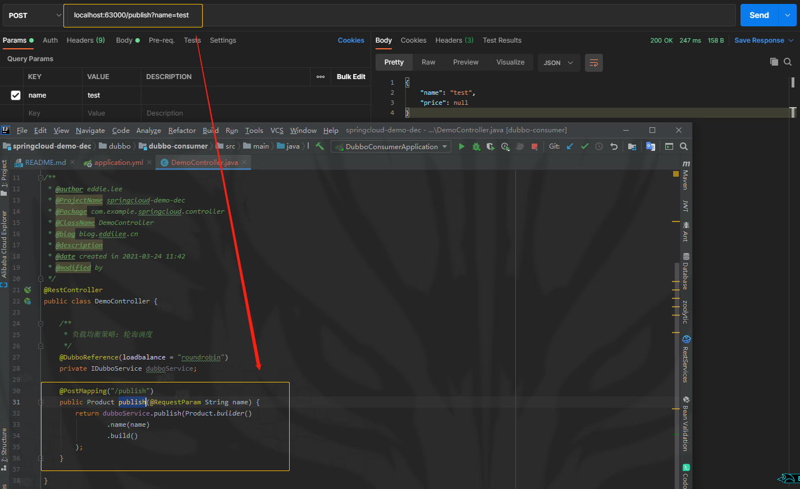
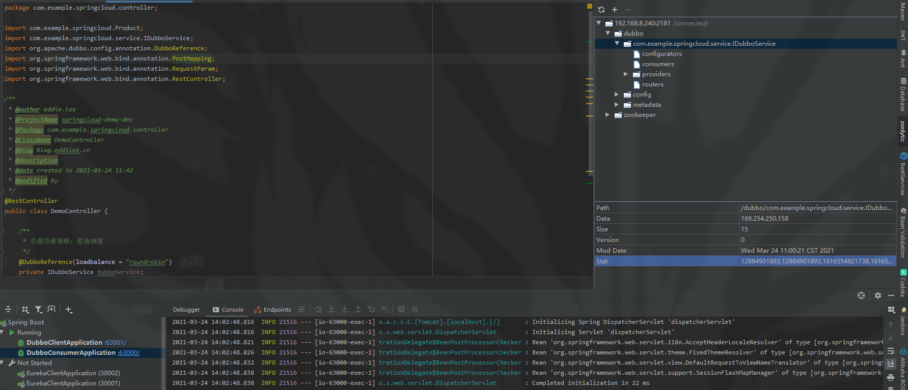
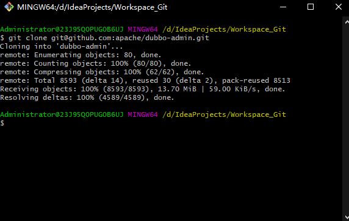
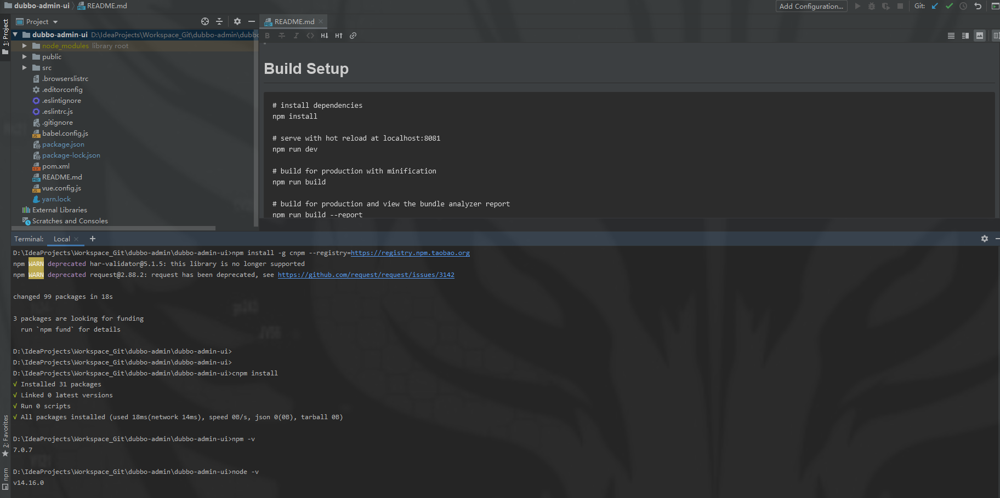
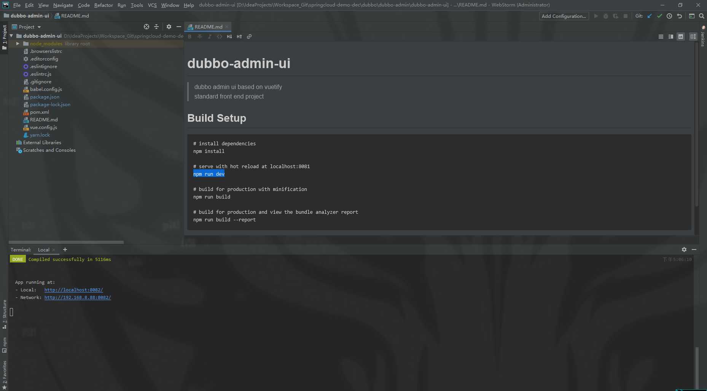

[TOC]

# 目录

## 1-1 本章概述

- 服务治理 - RPC vs HTTP
- Dubbo
  - 架构设计
  - 核心功能
- Dubbo 注册中心介绍
  - Demo - 基于Zookeeper构建注册中心
- RPC协议解析
- Demo - 构建服务消费者, 发起远程调用
- Dubbo服务容错、 负载均衡
- 基于Dubbo-Admin的服务治理
- 源码品读 - 围观阿里超快猛开发模式的产物Dubbo
- 相爱相杀的HSF和Dubbo

## 1-2 RPC vs HTTP

- RPC(Remote Procedure Call) 远程方法调用 
  - 服务治理
    - 分布式环境注册中心
  - RPC协议
    - 方法寻址、对象序列化/反序列化
- 接口风格
  - RPC (动词命名)
    - queryProduct
	- 面向执行过程
  - REST (名词)
    - {GET}/product?id=3
	- 面向所操作的资源

### 服务治理 RPC Vs HTTP

 / | RPC | HTTP
---|---|---
应用层协议 | RPC协议底层传输基于TCP | 超文本传输协议底层传输基于TCP
编程有好程序 | 配置简单高效接口拿来就用 | 配置繁琐 资源定位, GET/POST...
传输效率 | 应用gzip等压缩技术 | HTTP信息臃肿报文中有效信息占比小
框架实现难度 | 难 | 简单

### 疑问：

问：按上述所示, 为什么还要用Spring Cloud 和 Eureka? <br>
答：RPC再好也不就是个服务治理框架, 能有Spring Cloud全家桶组件吗?


## 1-5 Dubbo注册中心

- Multicast (不推荐生产使用)
- Zookeeper (推荐)
- Nacos
- Redis
- Simple

### 基于Zookeeper的服务注册 （树状结构）

- 根节点 - {Dubbo}
- 服务名 - {service1}、{service2}
- 类型 - {Provider]、{Consumer]
- URL - 172.0.0.1:8080(服务提供方)、172.0.0.2:8080(服务提供方)、172.0.1.1:8080(服务调用方)

## 1-6 【Demo】创建基于Zookeeper注册中心的生产者服务

### 构建服务提供方

- [Docker部署Zookeeper集群](https://blog.csdn.net/eddielee9217/article/details/115125874?spm=1001.2014.3001.5501)
- 启动Zookeeper作为注册中心
- 创建dubbo-api接口层 (服务消费者调用)
- 创建dubbo-provider, 添加Service层

#### 1.6.1 创建两个子项目, 分别 dubbo-api 与 dubbo-client

##### dubbo-api 
创建商品的实体类
```java
//com.example.springcloud.Product

@Data
public class Product implements Serializable {

    /**
     * dubbo的实体需要添加序列化或反序列化, 不然会报错的
     */
    private static final long serialVersionUID = -96420682L;

    /**
     * 商品名称
     */
    private String name;

    /**
     * 商品价格
     */
    private BigDecimal price;

}
```

创建商品的接口层
```java
// com.example.springcloud.service.IDubboService

public interface IDubboService {

	/**
	 * 发布商品
	 * 
	 * @param product
	 * @return
	 */
	Product publish(Product product);

}

```
  
##### dubbo-client

启动类添加注解

@EnableDubbo 需要是 org.apache.dubbo.config.spring.context.annotation.EnableDubbo 包

添加Maven依赖
```xml
<?xml version="1.0" encoding="UTF-8"?>
<project xmlns="http://maven.apache.org/POM/4.0.0"
         xmlns:xsi="http://www.w3.org/2001/XMLSchema-instance"
         xsi:schemaLocation="http://maven.apache.org/POM/4.0.0 http://maven.apache.org/xsd/maven-4.0.0.xsd">
    <parent>
        <artifactId>springcloud-demo-dec</artifactId>
        <groupId>com.example</groupId>
        <version>1.0.0-SNAPSHOT</version>
        <relativePath>../../pom.xml</relativePath>
    </parent>
    <modelVersion>4.0.0</modelVersion>

    <artifactId>dubbo-client</artifactId>
    <properties>
<!--        <dubbo.version>2.7.3</dubbo.version>-->
        <dubbo.version>2.7.9</dubbo.version>
    </properties>

    <dependencies>
        <dependency>
            <groupId>org.springframework.boot</groupId>
            <artifactId>spring-boot-starter-web</artifactId>
        </dependency>
        <!--zookeeper 注册中心客户端引入 使用的是curator客户端 -->
        <dependency>
            <groupId>org.apache.dubbo</groupId>
            <artifactId>dubbo-dependencies-zookeeper</artifactId>
            <version>${dubbo.version}</version>
            <type>pom</type>
<!--            <exclusions>-->
<!--                <exclusion>-->
<!--                    <groupId>org.slf4j</groupId>-->
<!--                    <artifactId>slf4j-log4j12</artifactId>-->
<!--                </exclusion>-->
<!--            </exclusions>-->
        </dependency>
        <!-- dubbo -->
        <dependency>
            <groupId>org.apache.dubbo</groupId>
            <artifactId>dubbo</artifactId>
            <version>${dubbo.version}</version>
        </dependency>
        <!-- spring-boot -->
        <dependency>
            <groupId>org.apache.dubbo</groupId>
            <artifactId>dubbo-spring-boot-starter</artifactId>
            <version>${dubbo.version}</version>
        </dependency>
        <!-- impl -->
        <dependency>
            <groupId>${project.groupId}</groupId>
            <artifactId>dubbo-api</artifactId>
            <version>${project.version}</version>
        </dependency>
    </dependencies>

</project>
```

创建商品的实现层
```java
// com.example.springcloud.service.impl.DubboServiceImpl

@Slf4j
@DubboService
public class DubboServiceImpl implements IDubboService {

    /**
     * 发布商品
     *
     * @param product
     * @return
     */
    @Override
    public Product publish(Product product) {
        log.info("Publish Product：[{}]",product.getName());
        return product;
    }

}
```

application.yml
```yaml
server:
  port: 63001

dubbo:
  application:
    name: dubbo-client
  registry:
    #address: zookeeper://192.168.8.240:2181 # zookeeper address ip
    address: zookeeper://192.168.8.240:2181?backup=192.168.8.240:2182,192.168.8.240:2183  # zookeeper cluster address ip
    timeout: 10000 # 解决 zookeeper not connected - https://blog.csdn.net/weixin_43275277/article/details/106544510
    protocol: zookeeper
    check: false # 启动时检查是否存在，注册中心不存在就报错
  metadata-report:
    address: zookeeper://192.168.8.240:2181
  protocol:  # 协议配置
    name: dubbo     # name必填，指定协议类型
                    # dubbo协议缺省端口为20880，rmi为1099，http和hessian为80
  monitor:
    protocol: register # 用于配置连接监控中心相关信息，可选
```

启动 dubbo-client 查看是否正常


## 1-9 【Demo】构建服务消费者 

- 创建dubbo-consumer作为服务调用方
- 添加Controller并调用dubbo-client中的服务
- 注意序列化/反序列化的异常


### 1.9.1 创建 dubbo-consumer

启动类
```java
// com.example.springcloud.DubboConsumerApplication

@EnableDubbo // import org.apache.dubbo.xxxx
@SpringBootApplication
public class DubboConsumerApplication {

    public static void main(String[] args) {
        SpringApplication.run(DubboConsumerApplication.class);
    }

}
```

控制层
```java
// com.example.springcloud.controller.DemoController#publish

@RestController
public class DemoController {

    /**
     * 负载均衡策略: 轮询调度
     */
    @DubboReference(loadbalance = "roundrobin")
    private IDubboService dubboService;

	@PostMapping("/publish")
	public Product publish(@RequestParam String name) {
        return dubboService.publish(Product.builder()
                .name(name)
                .build()
        );
	}

}
```

application.yml
```yaml
server:
  port: 63000

dubbo:
  application:
    name:  dubbo-consumer
  registry:
    #address: zookeeper://192.168.8.240:2181 # zookeeper address ip
    address: zookeeper://192.168.8.240:2181?backup=192.168.8.240:2182,192.168.8.240:2183  # zookeeper cluster address ip
    timeout: 10000 # 解决 zookeeper not connected - https://blog.csdn.net/weixin_43275277/article/details/106544510
    protocol: zookeeper
    check: false
  # dubbo-admin配置
  metadata-report:
    address: zookeeper://192.168.8.240:2181?backup=192.168.8.240:2182,192.168.8.240:2183  # zookeeper cluster address ip
  monitor:
    protocol: register
  consumer:
    # 启动时检查服务提供者是否存在，不存在就报错
    check: false
    timeout: 3000
```

### 1.9.2 测试

使用 PostMan



dubbo-consumer console：



dubbo-client console：

```text
2021-03-24 14:02:48.957  INFO 18568 --- [:20880-thread-2] c.e.s.service.impl.DubboServiceImpl      : Publish Product：[test]
```

## 1-10 基于Dubbo-Admin的服务治理-1

- 什么是Dubbo-Admin
  - 服务治理可视化
    - 条件路由、标签路由、黑白名单、服务权重、负载均衡、服务测试
  - 前端项目
    - Vue.js + Vuetify 实现
  - 后端项目
    - 标准Spring Boot工程
- 服务治理兼容
  - Dubbo版本
    - 2.6 - Everything in Registry center (所有信息都存在注册中心)
    - 2.7 - 注册中心、配置中心、元数据中心

### 1.10.1 基于DA服务治理（一）

- [Github Download Dubbo-Admin](https://github.com/apache/dubbo-admin)
- 安装前端工程（安装nodejs环境）
  - 修改npm代理, 执行npm install

Github 拉取源码



> 进入项目或工具打开 dubbo-admin-ui 配置代理: <br>
npm install -g cnpm --registry=https://registry.npm.taobao.org <br>
cnpm install




## 1-11 基于Dubbo-Admin的服务治理-2

### 1.11.1 基于DA服务治理（二）

- 修改Zookeeper冲突端口 (不同的服务器的话就忽略这项, 另外如果使用docker的, 也需要手动添加端口~)
  - 修改 "/apache-zookeeper-3.6.2-bin/conf/zoo.cfg"
  - 尾巴添加 "admin.serverPort=63010" 端口号是自定义~ 你喜欢就好！
  - 修改配置, 必需要重启zk
- 元数据配置
- 启动dubbo-admin的前后端项目


### 1.11.2 迁移代码库

1. dubbo-admin 复制到本地 springcloud-demo-dec 项目中
1. 对准 pom.xml 右键添加 add Maven (静待依赖加载...)
1. 顺序启动后端服务
    1. DubboClientApplication :63001/
    1. DubboConsumerApplication :63000/
    1. DubboAdminApplication :8080/  (dubbo/dubbo-admin-server项目的启动类)
1. 启动前端服务
    1. cnpm run dev
    



### 1.11.3 访问 Dubbo Admin UI

- http://localhost:8082/
- 用户密码（注意：root用户的密码是root，guest用户的密码是guest）

<br>

[GitHub](https://github.com/eddie-code) <br>
[博客园](https://www.cnblogs.com/EddieBlog) <br>
[CSDN](https://blog.csdn.net/eddielee9217) <br>
[自建博客](https://blog.eddilee.cn/s/about) <br>
