[TOC]

# 前言

## 2-4 Stream快速入门-集成MQ消费

- 创建 stream-sample 项目, 引入依赖
- 创建监听器 (声明和绑定信道)
- 从RabbitMQ触发消息

### RabbitMQ 界面操作

1. http://192.168.8.240:15672 (guest/guest)
1. 查看 Queue input.anonymous.Z5LyfIlEQtqw3hcJTAhHfA
1. 发送消息
	- 下方 Publish message
	- Payload: 自定义内容
	- 点击按钮 Publish message
	- IDEA控制台就会提示:"message consumed successfully, payload=自定义内容"
	
[Docker部署RabbitMQ](https://blog.eddilee.cn/archives/docker%E9%83%A8%E7%BD%B2rabbitmq%E9%9B%86%E7%BE%A4)

## 2-8 基于发布订阅实现广播功能

- 创建消息生产者Producer服务, 配置消息主题
- 启动多个消费者Consumer节点测试消息广播
- RabbitMQ界面查看广播组（Exchanges）

### 自定义主题 (Topic)

com.example.springcloud.topic.MyTopic
```java
public interface MyTopic {

	/**
	 * Input channel name.
	 */
	String INPUT = "myTopic-consumer";

	/**
	 * Output channel name.
	 */
	String OUTPUT = "myTopic-producer";

	/**
	 * input=消费者
	 */
	@Input(INPUT)
	SubscribableChannel input();

	/**
	 * output=生产者
	 */
	@Output(OUTPUT)
	MessageChannel output();

}
```

### 添加消费者

com.example.springcloud.biz.StreamConsumer
```java
@Slf4j
// 绑定信道
@EnableBinding(
        value = {
                Sink.class,
				MyTopic.class
        }
)
public class StreamConsumer {

    @StreamListener(Sink.INPUT)
	public void consume(Object payload) {
		log.info("message consumed successfully, payload={}", payload);
	}

	@StreamListener(MyTopic.INPUT)
	public void consumeMyMessage(Object payload) {
		log.info("my message consumed successfully, payload={}", payload);
	}

}
```

### 使用配置文件, 绑定生产者和消费者的通道

application.yml
```yaml
# 绑定 Channel 到 broadcast
spring:
  cloud:
    stream:
      bindings:
        myTopic-consumer:  # 消费者绑定
          destination: broadcast # rabbitMq界面显示 Exchange
        myTopic-producer:  # 生产者绑定
          destination: broadcast
```

### 启动与测试

（1） 按不同端口启动
- StreamApplication (63000) :63000/
- StreamApplication (63001) :63001/

（2） Postman (demo - 最简单的生产者消费者)
- POST localhost:63000/send
- Body (x-www-form-urfencoded)
  - body:hello broadcast
- 63000、630001 控制台打印：
  - my message consumed successfully, payload=hello broadcast
  
（3） RabbitMQ WEB
- 打开 http://192.168.8.240:15672
- 查看顶部 Exchanges 下面是否存在 "broadcast"
- 查看 Bindings (每一个Queues都对应后台一个监听队列)
  - broadcast.anonymous.DIILcrP3SvaGEUv6dfiAqQ
  - broadcast.anonymous.UnlUchdPQnaavW5uBIQjEA
- 查看顶部 Queues 是否存在对应 Bindings
  - 点击 broadcast.anonymous.DIILcrP3SvaGEUv6dfiAqQ 
  - 进入后, 点击 Publish message 输入"queues test"
  - 返回 IDEA控制台 就会显示该条 Message
    - my message consumed successfully, payload=queues test


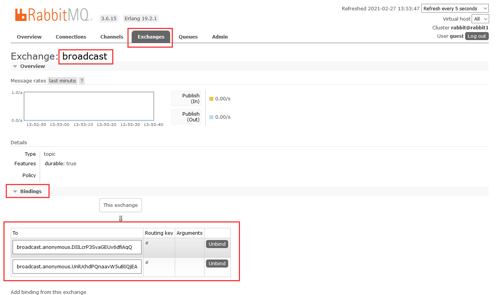

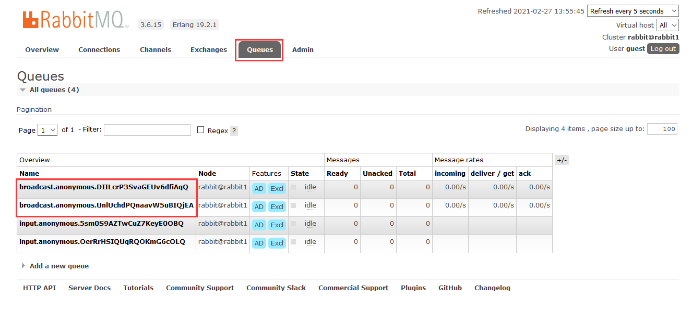

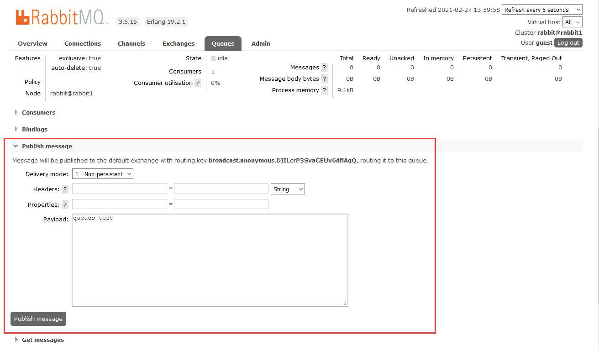


## 2-10 消费组和消息分区详解

### 消费组

前面我们接触的都是广播场景，话说这个广播模式简直就是个围观模式，所有订阅相同主题的消费者都眼巴巴看着生产者发布的消息，一个消息在所有节点都要被消费一遍。如果我只想挑一个节点来消费消息，而且又不能只逮着一只羊来薅羊毛，必须利用负载均衡来分发请求。这个Stream能不能办到呢？
这不就是单播模式吗，那自然不在话下，Stream里的消费组就是专门解决这个问题的。让我们来用一个案例说明它的工作模式：


在上面这个例子中，“商品发布”就是一个消息，它被放到了对应的消息队列中，有两拨人马同时盯着这个Topic，这两拨人马各自组成了一个Group，每次有新消息到来的时候，每个Group就派出一个代表去响应，而且是从这个Group中轮流挑选代表（负载均衡），这里的Group也就是我们说的消费者。
在Stream里配置一个消费组非常简单，下一小节我就带大家去做一个Demo。在这里我就先小剧透一点内容好了：

spring.cloud.stream.bindings.group-producer.group=Group-A

看破不说破，这里面是什么含义，且听下节分享。

### 消费分区

消费分区消费组，傻傻分不清楚。这两个名字听起来很像，其实并不是一码事，消费组相当于是每组派一个代表去办事儿，而消费分区相当于是专事专办，也就是说，所有消息都会根据分区Key进行划分，带有相同Key的消息只能被同一个消费者处理。
我们来看下面的消息分区例子：

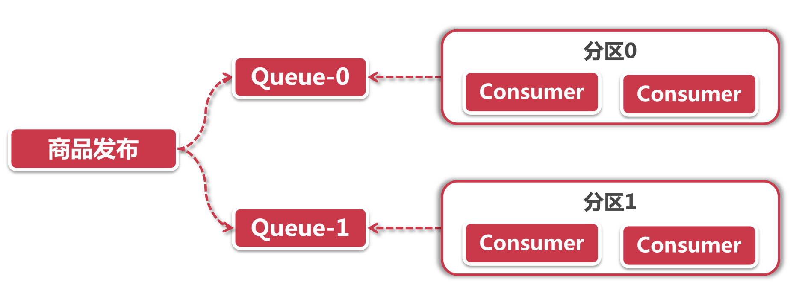

消息分区有一个预定义的分区Key，它是一个SpEL表达式（想想前面哪一章节讲过SpEL？提示换一下，Key Resolver）。我们需要在配置文件中指定分区的总个数N，Stream就会为我们创建N个分区，这里面每个分区就是一个Queue（可以在RabbitMQ管理界面中看到所有的分区队列）。
当商品发布的消息被生产者发布时，Stream会计算得出分区Key，从而决定这个消息应该加入到哪个Queue里面。在这个过程中，每个消费组/消费者仅会连接到一个Queue，这个Queue中对应的消息只能被特定的消费组/消费者来处理。

## 2-11 基于消费组实现轮循单播功能

- 创建 Producer和Consumer
- 配置消费组, 启动两个节点
- RabbitMQ界面单播和广播在Exchange中的不同
- 消费分区的配置项

### 创建 GroupTopic

com.example.springcloud.topic.GroupTopic
```java
public interface GroupTopic {

	/**
	 * Input channel name.
	 */
	String INPUT = "group-consumer";

	/**
	 * Output channel name.
	 */
	String OUTPUT = "group-producer";

	/**
	 * input=消费者
	 */
	@Input(INPUT)
	SubscribableChannel input();

	/**
	 * output=生产者
	 */
	@Output(OUTPUT)
	MessageChannel output();

}
```

com.example.springcloud.biz.controller.DemoController

```java
@Autowired
private GroupTopic groupTopicProducer;  // StreamConsumer 没有绑定前是找不到 标记红色波浪线

@PostMapping("sendToGroup")
public void sendMessageToGroup(@RequestParam(value = "body") String body) {
    groupTopicProducer.output().send(MessageBuilder.withPayload(body).build());
}
```

com.example.springcloud.biz.StreamConsumer
```java
@Slf4j
@EnableBinding(
        value = { GroupTopic.class }
)
public class StreamConsumer {

	@StreamListener(GroupTopic.INPUT)
	public void consumeGroupMessage(Object payload) {
		log.info("Gourp message consumed successfully, payload={}", payload);
	}

}
```

```yaml
---
# 消息分组示例
spring:
  cloud:
    stream:
      bindings:
        group-consumer:  # 消费者绑定
          destination: group-topic
          group: Group-A
        group-producer:  # 生产者绑定
          destination: group-topic

---
# 消费分区配置
spring:
  cloud:
    stream:
      bindings:
        group-consumer: # com.example.springcloud.topic.GroupTopic
          consumer:
            partitioned: true # 打开消费者的消费分区功能
        group-producer:
          producer:
            partition-count: 2 # 两个消息分区
            # SpEL (Key resolver) 可以定义复杂表达式生成Key
            # 我们这里用最简化的配置，只有索引参数为 1 的节点（消费者），才能消费消息 ***
            partition-key-expression: "1"
      instanceCount: 2 # 当前消费者实例总数
      instanceIndex: 1 # 最大值 instanceCount-1，当前实例的索引号 ***
```

### 启动与测试

1. StreamApplication (63000) : Group-A-0
    1. 修改 "spring.cloud.stream.instanceIndex=0"
1. StreamApplication (63001) : Group-A-1
    1. 修改 "spring.cloud.stream.instanceIndex=1"
1. 使用PostMan测试
    1. localhost:63000/sendToGroup
    1. Body (x-www-form-urfencoded)
    1. body:Test 测试 1234

```xml
如何指定:
通过消息分区实现：
请求后 Group-A-1 的控制台会出现打印信息 "Test 测试 1234", 
无论请求多少次都会在 Group-A-1 打印,
为什么呢? 
因为设置了 "partition-key-expression: "1"" 指定消费

TIPS: 比如已经指定了 Group-A-1 端口 63000, 再启动多个 Group-A-1 端口 63001, 然后再次请求, 会发现他们是依次轮询打印到控制台
```

> spring.cloud.stream.bindings.group-consumer.group=Group-A 重点是这个分组配置来区分

## 2-13 Stream+ MQ插件实现延迟消息

- 配置插件, 重启RabbitMQ
- 创建 Producer 和 Consumer, 配置exchange-type
- 添加Message Header传递延迟时间
- 启动查看效果

### RabbitMQ部分

#### 部署与安装插件
- [Docker - rabbitmq:3.6.15 部署](https://blog.eddilee.cn/archives/docker%E9%83%A8%E7%BD%B2rabbitmq%E9%9B%86%E7%BE%A4) 
- [Docker - rabbitmq:3.6.15 部署 (备份地址)](https://blog.csdn.net/eddielee9217/article/details/113713318) 
- [延迟消息 - 官方插件版本](https://www.rabbitmq.com/community-plugins.html)
- [参考资料 - 安装插件](https://blog.csdn.net/wangming520liwei/article/details/103352440)

(1) &nbsp; 终端直接下载 (部署的版本是：3.6.15)
```shell script
[root@k8s-master1 opt]# wget https://dl.bintray.com/rabbitmq/community-plugins/3.6.x/rabbitmq_delayed_message_exchange/rabbitmq_delayed_message_exchange-20171215-3.6.x.zip
--2021-03-01 22:28:32--  https://dl.bintray.com/rabbitmq/community-plugins/3.6.x/rabbitmq_delayed_message_exchange/rabbitmq_delayed_message_exchange-20171215-3.6.x.zip
Resolving dl.bintray.com (dl.bintray.com)... 44.239.142.179, 52.10.12.153, 52.32.247.225, ...
Connecting to dl.bintray.com (dl.bintray.com)|44.239.142.179|:443... connected.
HTTP request sent, awaiting response... 200 OK
Length: 29853 (29K) [application/zip]
Saving to: ‘rabbitmq_delayed_message_exchange-20171215-3.6.x.zip’

100%[==============================================================================================================================================================================================>] 29,853      73.7KB/s   in 0.4s   
```

(2) &nbsp; 解压
```shell script
[root@k8s-master1 opt]# unzip rabbitmq_delayed_message_exchange-20171215-3.6.x.zip
Archive:  rabbitmq_delayed_message_exchange-20171215-3.6.x.zip
  inflating: rabbitmq_delayed_message_exchange-20171215-3.6.x.ez  
```

(3) &nbsp; 拷贝到容器里
```shell script
[root@k8s-master1 ~]# docker cp /opt/rabbitmq_delayed_message_exchange-20171215-3.6.x.ez myrabbit1:/opt
```

(4) &nbsp; 进入容器
```shell script
[root@k8s-master1 opt]# docker exec -it myrabbit1 bash

root@rabbit1:/# cp /opt/rabbitmq_delayed_message_exchange-20171215-3.6.x.ez /usr/lib/rabbitmq/lib/rabbitmq_server-3.6.15/plugins
```

(5) &nbsp; 从 opt 到插件 plugins 里
```shell script
root@rabbit1:/usr/lib/rabbitmq/lib/rabbitmq_server-3.6.15/plugins# cd /usr/lib/rabbitmq/lib/rabbitmq_server-3.6.15/sbin

root@rabbit1:/usr/lib/rabbitmq/lib/rabbitmq_server-3.6.15/sbin# rabbitmq-plugins enable rabbitmq_delayed_message_exchange
The following plugins have been enabled:
  rabbitmq_delayed_message_exchange

Applying plugin configuration to rabbit@rabbit1... started 1 plugin.
```

(6) &nbsp; 查看 rabbitmq_delayed_message_exchange 是否安装成功
```shell script
root@rabbit1:/usr/lib/rabbitmq/lib/rabbitmq_server-3.6.15/sbin# rabbitmq-plugins list
 Configured: E = explicitly enabled; e = implicitly enabled
 | Status:   * = running on rabbit@rabbit1
 |/
[e*] amqp_client                       3.6.15
[e*] cowboy                            1.0.4
[e*] cowlib                            1.0.2
[  ] rabbitmq_amqp1_0                  3.6.15
[  ] rabbitmq_auth_backend_ldap        3.6.15
[  ] rabbitmq_auth_mechanism_ssl       3.6.15
[  ] rabbitmq_consistent_hash_exchange 3.6.15
[E*] rabbitmq_delayed_message_exchange 20171215-3.6.x
[  ] rabbitmq_event_exchange           3.6.15
[  ] rabbitmq_federation               3.6.15
[  ] rabbitmq_federation_management    3.6.15
[  ] rabbitmq_jms_topic_exchange       3.6.15
[E*] rabbitmq_management               3.6.15
[e*] rabbitmq_management_agent         3.6.15
[  ] rabbitmq_management_visualiser    3.6.15
[  ] rabbitmq_mqtt                     3.6.15
[  ] rabbitmq_random_exchange          3.6.15
[  ] rabbitmq_recent_history_exchange  3.6.15
[  ] rabbitmq_sharding                 3.6.15
[  ] rabbitmq_shovel                   3.6.15
[  ] rabbitmq_shovel_management        3.6.15
[  ] rabbitmq_stomp                    3.6.15
[  ] rabbitmq_top                      3.6.15
[  ] rabbitmq_tracing                  3.6.15
[  ] rabbitmq_trust_store              3.6.15
[e*] rabbitmq_web_dispatch             3.6.15
[  ] rabbitmq_web_mqtt                 3.6.15
[  ] rabbitmq_web_mqtt_examples        3.6.15
[  ] rabbitmq_web_stomp                3.6.15
[  ] rabbitmq_web_stomp_examples       3.6.15
[  ] sockjs                            0.3.4
```

(7) &nbsp; Reboot Rabbitmq
```shell script
方式一
docker restart myrabbit1 myrabbit2 myrabbit3

方式二
docker exec -it myrabbit1 bash
rabbitmqctl stop
rabbitmq-server
```

(8) &nbsp; 访问 WEB UI
```shell script
http://192.168.8.240:15672
```

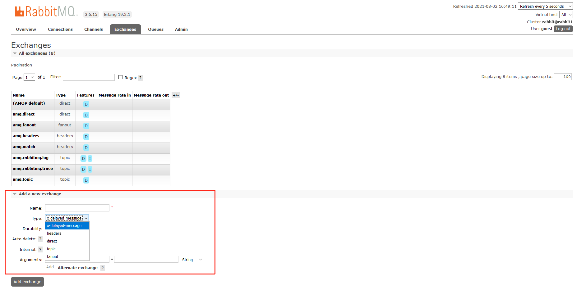

### Quick start

(1) &nbsp; 创建Topic
```java
public interface DelayedTopic {

	/**
	 * Input channel name.
	 */
	String INPUT = "delayed-consumer";

	/**
	 * Output channel name.
	 */
	String OUTPUT = "delayed-producer";

	/**
	 * input=消费者
	 */
	@Input(INPUT)
	SubscribableChannel input();

	/**
	 * output=生产者
	 */
	@Output(OUTPUT)
	MessageChannel output();

}
```

(2) &nbsp; 创建请求接口

com.example.springcloud.biz.controller.DemoController
```java
@PostMapping("sendDM")
public void sendDelayedMessage(@RequestParam(value = "body") String body,
        @RequestParam(value = "seconds") Integer seconds) {

    MessageBean msg = new MessageBean();
    msg.setPayload(body);

    log.info("[{}]秒后准备发送延迟消息",seconds);

    delayedTopicProducer.output().send(
            MessageBuilder.withPayload(msg)
                    .setHeader("x-delay", seconds * 1000)
                    .build()
    );
}
```

(3) &nbsp; 消费者创建打印MessageBaen信息

com.example.springcloud.biz.StreamConsumer
```java
@StreamListener(DelayedTopic.INPUT)
public void consumeDelayedMessage(MessageBean bean) {
    log.info("Delayed message consumed successfully, payload={}", bean.getPayload());
}
```

(4) &nbsp; application.yml

```yaml
# 延迟消息配置
spring:
  cloud:
    stream:
      bindings:
        delayed-consumer:
          destination: delayed-topic
        delayed-producer:
          destination: delayed-topic
      rabbit:
        bindings:
          delayed-producer:
            producer:
              delayed-exchange: true # 延迟队列
```

(4) &nbsp; PostMan请求测试

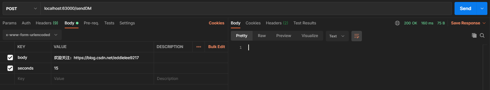

控制台打印 (38-23) 刚好 15s
```text
2021-03-03 14:29:23.172  INFO 16512 --- [io-63000-exec-1] c.e.s.biz.controller.DemoController      : [15]秒后准备发送延迟消息
2021-03-03 14:29:23.184  INFO 16512 --- [io-63000-exec-1] o.s.a.r.c.CachingConnectionFactory       : Attempting to connect to: [192.168.8.240:5672]
2021-03-03 14:29:23.194  INFO 16512 --- [io-63000-exec-1] o.s.a.r.c.CachingConnectionFactory       : Created new connection: rabbitConnectionFactory.publisher#3d78cf08:0/SimpleConnection@4898ec6c [delegate=amqp://guest@192.168.8.240:5672/, localPort= 11225]
2021-03-03 14:29:23.197  INFO 16512 --- [io-63000-exec-1] o.s.amqp.rabbit.core.RabbitAdmin         : Auto-declaring a non-durable, auto-delete, or exclusive Queue (input.anonymous.FLQqBEtsQ_-ti45RQP4C5g) durable:false, auto-delete:true, exclusive:true. It will be redeclared if the broker stops and is restarted while the connection factory is alive, but all messages will be lost.
2021-03-03 14:29:23.197  INFO 16512 --- [io-63000-exec-1] o.s.amqp.rabbit.core.RabbitAdmin         : Auto-declaring a non-durable, auto-delete, or exclusive Queue (broadcast.anonymous.sVMurJRTTPmzbJeiv2_YCA) durable:false, auto-delete:true, exclusive:true. It will be redeclared if the broker stops and is restarted while the connection factory is alive, but all messages will be lost.
2021-03-03 14:29:23.197  INFO 16512 --- [io-63000-exec-1] o.s.amqp.rabbit.core.RabbitAdmin         : Auto-declaring a non-durable, auto-delete, or exclusive Queue (delayed-topic.anonymous.zRO1l6z8R8yoRe-iHDcfMA) durable:false, auto-delete:true, exclusive:true. It will be redeclared if the broker stops and is restarted while the connection factory is alive, but all messages will be lost.

2021-03-03 14:29:38.244  INFO 16512 --- [8yoRe-iHDcfMA-1] c.e.springcloud.biz.StreamConsumer       : Delayed message consumed successfully, payload=欢迎关注：https://blog.csdn.net/eddielee9217
```

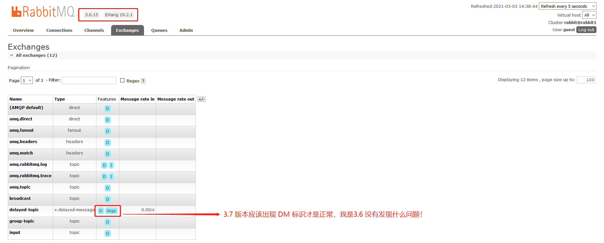


## 2-14 Stream本地重试功能

- 创建Producer和Consumer, 在Consumer中抛出异常
- 设置重试次数
- 重试成功和失败的表现

### 异常重试（单机版）

(1) &nbsp; 创建 ErrorTopic

com.example.springcloud.topic.ErrorTopic

```java
public interface ErrorTopic {

	/**
	 * Input channel name.
	 */
	String INPUT = "error-consumer";

	/**
	 * Output channel name.
	 */
	String OUTPUT = "error-producer";

	/**
	 * input=消费者
	 */
	@Input(INPUT)
	SubscribableChannel input();

	/**
	 * output=生产者
	 */
	@Output(OUTPUT)
	MessageChannel output();

}
```

(2) &nbsp; 创建入口

com.example.springcloud.biz.controller.DemoController
```java
@PostMapping("sendError")
public void sendErrorMessage(@RequestParam(value = "body") String body) {
    MessageBean msg = new MessageBean();
    msg.setPayload(body);
    errorTopicProducer.output().send(
            MessageBuilder.withPayload(msg).build()
    );
}
```

(3) &nbsp; 创建消费

com.example.springcloud.biz.StreamConsumer
```java
@StreamListener(ErrorTopic.INPUT)
public void consumeErrorMessage(MessageBean bean) {
    log.info("你还好吗？");
    // 每次都自增一 当你被三整除就放行
    if (count.incrementAndGet() % 3 == 0) {
        log.info("很好，谢谢。你呢？");
        // 成功消费以后, 就会清零
        count.set(0);
    } else {
        log.info("你怎么回事啊？");
        throw new RuntimeException("我不好~");
    }
}
```
(4) &nbsp; application.yml
```yaml
spring:
  cloud:
    stream:
      bindings:
        error-consumer: # com.example.springcloud.topic.ErrorTopic
          destination: error-out-topic
          # 重试次数（本机重试）
          # 次数=1 相当于不重试 (不生效), 至少等于=2 才生效
          consumer:
            max-attempts: 2
        error-producer:
          destination: error-out-topic
```

(5) &nbsp; PostMan测试

```text
POST localhost:63000/sendError

body:欢迎关注：https://blog.csdn.net/eddielee9217
```

第一次请求控制台打印：
```text
2021-03-03 22:32:01.928  INFO 3232 --- [fWtFNuaMvhNrQ-1] c.e.springcloud.biz.StreamConsumer       : 你还好吗？
2021-03-03 22:32:01.928  INFO 3232 --- [fWtFNuaMvhNrQ-1] c.e.springcloud.biz.StreamConsumer       : 你怎么回事啊？
2021-03-03 22:32:02.931  INFO 3232 --- [fWtFNuaMvhNrQ-1] c.e.springcloud.biz.StreamConsumer       : 你还好吗？
2021-03-03 22:32:02.931  INFO 3232 --- [fWtFNuaMvhNrQ-1] c.e.springcloud.biz.StreamConsumer       : 很好，谢谢。你呢？
```

第二次请求控制台打印：
```text
2021-03-03 22:46:32.802  INFO 3232 --- [fWtFNuaMvhNrQ-1] c.e.springcloud.biz.StreamConsumer       : 你还好吗？
2021-03-03 22:46:32.803  INFO 3232 --- [fWtFNuaMvhNrQ-1] c.e.springcloud.biz.StreamConsumer       : 你怎么回事啊？
2021-03-03 22:46:33.804  INFO 3232 --- [fWtFNuaMvhNrQ-1] c.e.springcloud.biz.StreamConsumer       : 你还好吗？
2021-03-03 22:46:33.804  INFO 3232 --- [fWtFNuaMvhNrQ-1] c.e.springcloud.biz.StreamConsumer       : 你怎么回事啊？
2021-03-03 22:46:33.807 ERROR 3232 --- [fWtFNuaMvhNrQ-1] o.s.integration.handler.LoggingHandler   : org.springframework.messaging.MessagingException: Exception thrown while invoking com.example.springcloud.biz.StreamConsumer#consumeErrorMessage[1 args]; nested exception is java.lang.RuntimeException: 我不好~, failedMessage=GenericMessage [payload=byte[63], headers={amqp_receivedDeliveryMode=PERSISTENT, amqp_receivedExchange=error-out-topic, amqp_deliveryTag=2, deliveryAttempt=2, amqp_consumerQueue=error-out-topic.anonymous._hDU9IsTSfWtFNuaMvhNrQ, amqp_redelivered=false, amqp_receivedRoutingKey=error-out-topic, amqp_timestamp=Wed Mar 03 22:46:32 CST 2021, amqp_messageId=6aa4565e-5b6b-ac90-d68e-58d3ec0b0800, id=e372c416-0c2f-6bc6-1509-53dac5f87167, amqp_consumerTag=amq.ctag-WsxmwGdQJ4yHUbdoHvQtdw, contentType=application/json, timestamp=1614782792802}]
	at org.springframework.cloud.stream.binding.StreamListenerMessageHandler.handleRequestMessage(StreamListenerMessageHandler.java:64)
	at org.springframework.integration.handler.AbstractReplyProducingMessageHandler.handleMessageInternal(AbstractReplyProducingMessageHandler.java:123)
	at org.springframework.integration.handler.AbstractMessageHandler.handleMessage(AbstractMessageHandler.java:162)
	at org.springframework.integration.dispatcher.AbstractDispatcher.tryOptimizedDispatch(AbstractDispatcher.java:115)
	at org.springframework.integration.dispatcher.UnicastingDispatcher.doDispatch(UnicastingDispatcher.java:132)
	at org.springframework.integration.dispatcher.UnicastingDispatcher.dispatch(UnicastingDispatcher.java:105)
	at org.springframework.integration.channel.AbstractSubscribableChannel.doSend(AbstractSubscribableChannel.java:73)
	at org.springframework.integration.channel.AbstractMessageChannel.send(AbstractMessageChannel.java:453)
	at org.springframework.integration.channel.AbstractMessageChannel.send(AbstractMessageChannel.java:401)
	at org.springframework.messaging.core.GenericMessagingTemplate.doSend(GenericMessagingTemplate.java:187)
	at org.springframework.messaging.core.GenericMessagingTemplate.doSend(GenericMessagingTemplate.java:166)
	at org.springframework.messaging.core.GenericMessagingTemplate.doSend(GenericMessagingTemplate.java:47)
	at org.springframework.messaging.core.AbstractMessageSendingTemplate.send(AbstractMessageSendingTemplate.java:109)
	at org.springframework.integration.endpoint.MessageProducerSupport.sendMessage(MessageProducerSupport.java:205)
	at org.springframework.integration.amqp.inbound.AmqpInboundChannelAdapter.access$1100(AmqpInboundChannelAdapter.java:57)
	at org.springframework.integration.amqp.inbound.AmqpInboundChannelAdapter$Listener.lambda$onMessage$0(AmqpInboundChannelAdapter.java:211)
	at org.springframework.retry.support.RetryTemplate.doExecute(RetryTemplate.java:287)
	at org.springframework.retry.support.RetryTemplate.execute(RetryTemplate.java:180)
	at org.springframework.integration.amqp.inbound.AmqpInboundChannelAdapter$Listener.onMessage(AmqpInboundChannelAdapter.java:208)
	at org.springframework.amqp.rabbit.listener.AbstractMessageListenerContainer.doInvokeListener(AbstractMessageListenerContainer.java:1552)
	at org.springframework.amqp.rabbit.listener.AbstractMessageListenerContainer.actualInvokeListener(AbstractMessageListenerContainer.java:1478)
	at org.springframework.amqp.rabbit.listener.AbstractMessageListenerContainer.invokeListener(AbstractMessageListenerContainer.java:1466)
	at org.springframework.amqp.rabbit.listener.AbstractMessageListenerContainer.doExecuteListener(AbstractMessageListenerContainer.java:1461)
	at org.springframework.amqp.rabbit.listener.AbstractMessageListenerContainer.executeListener(AbstractMessageListenerContainer.java:1410)
	at org.springframework.amqp.rabbit.listener.SimpleMessageListenerContainer.doReceiveAndExecute(SimpleMessageListenerContainer.java:870)
	at org.springframework.amqp.rabbit.listener.SimpleMessageListenerContainer.receiveAndExecute(SimpleMessageListenerContainer.java:854)
	at org.springframework.amqp.rabbit.listener.SimpleMessageListenerContainer.access$1600(SimpleMessageListenerContainer.java:78)
	at org.springframework.amqp.rabbit.listener.SimpleMessageListenerContainer$AsyncMessageProcessingConsumer.mainLoop(SimpleMessageListenerContainer.java:1137)
	at org.springframework.amqp.rabbit.listener.SimpleMessageListenerContainer$AsyncMessageProcessingConsumer.run(SimpleMessageListenerContainer.java:1043)
	at java.lang.Thread.run(Thread.java:748)
Caused by: java.lang.RuntimeException: 我不好~
	at com.example.springcloud.biz.StreamConsumer.consumeErrorMessage(StreamConsumer.java:88)
	at sun.reflect.NativeMethodAccessorImpl.invoke0(Native Method)
	at sun.reflect.NativeMethodAccessorImpl.invoke(NativeMethodAccessorImpl.java:62)
	at sun.reflect.DelegatingMethodAccessorImpl.invoke(DelegatingMethodAccessorImpl.java:43)
	at java.lang.reflect.Method.invoke(Method.java:498)
	at org.springframework.messaging.handler.invocation.InvocableHandlerMethod.doInvoke(InvocableHandlerMethod.java:171)
	at org.springframework.messaging.handler.invocation.InvocableHandlerMethod.invoke(InvocableHandlerMethod.java:120)
	at org.springframework.cloud.stream.binding.StreamListenerMessageHandler.handleRequestMessage(StreamListenerMessageHandler.java:55)
	... 29 more
```

分析：
```text
第一次：  3 % 3 = 0

2021-03-03 22:57:59.771  INFO 6548 --- [zmiYknwj6_Azw-1] c.e.springcloud.biz.StreamConsumer       : 你还好吗？
2021-03-03 22:58:02.970  INFO 6548 --- [zmiYknwj6_Azw-1] c.e.springcloud.biz.StreamConsumer       : 很好，谢谢。你呢？


第二次：  1 % 3 = 1

2021-03-03 22:58:49.909  INFO 6548 --- [zmiYknwj6_Azw-1] c.e.springcloud.biz.StreamConsumer       : 你还好吗？
false
2021-03-03 22:59:39.875  INFO 6548 --- [zmiYknwj6_Azw-1] c.e.springcloud.biz.StreamConsumer       : 你怎么回事啊？
2021-03-03 22:59:40.876  INFO 6548 --- [zmiYknwj6_Azw-1] c.e.springcloud.biz.StreamConsumer       : 你还好吗？

********
第二次请求,也是不成功 1 不等于 0 就会自动重试机制, 就会打印下面的报错信息

为什么是第二次呢？  因为配置：spring.cloud.stream.bindings.error-consumer.consumer.max-attempts=2
********

false
2021-03-03 23:00:43.011  INFO 6548 --- [zmiYknwj6_Azw-1] c.e.springcloud.biz.StreamConsumer       : 你怎么回事啊？
2021-03-03 23:00:43.012 ERROR 6548 --- [zmiYknwj6_Azw-1] o.s.integration.handler.LoggingHandler   : org.springframework.messaging.MessagingException: Exception thrown while invoking com.example.springcloud.biz.StreamConsumer#consumeErrorMessage[1 args]; nested exception is java.lang.RuntimeException: 我不好~, failedMessage=GenericMessage [payload=byte[63], headers={amqp_receivedDeliveryMode=PERSISTENT, amqp_receivedExchange=error-out-topic, amqp_deliveryTag=6, deliveryAttempt=2, amqp_consumerQueue=error-out-topic.anonymous.dt-kEM12TzmiYknwj6_Azw, amqp_redelivered=false, amqp_receivedRoutingKey=error-out-topic, amqp_timestamp=Wed Mar 03 22:58:49 CST 2021, amqp_messageId=2c3f4678-6690-0a84-c5e7-fcf916bdf39c, id=a98a82f7-261d-ba23-d365-a4e1af91a390, amqp_consumerTag=amq.ctag-AatP0-GItUPPvBi92sxuPg, contentType=application/json, timestamp=1614783529909}]

```


## 2-16 Stream实现Requeue操作

> re-queue（重新入队）: 是指失败的消息, 放回到 RabbitMQ 当中, 然后让消费者的集群重新拉取消息.

- 创建Producer和Consumer
- 开启 Re-queue功能 ( retry配置有冲突 )
- 侧首 Re-queue在不同节点的消费情况

### 创建主题

com.example.springcloud.topic.RequeueTopic
```java
public interface RequeueTopic {

	/**
	 * Input channel name.
	 */
	String INPUT = "requeue-consumer";

	/**
	 * Output channel name.
	 */
	String OUTPUT = "requeue-producer";

	/**
	 * input=消费者
	 */
	@Input(INPUT)
	SubscribableChannel input();

	/**
	 * output=生产者
	 */
	@Output(OUTPUT)
	MessageChannel output();

}
```

### 创建生产者 (Producer)

```java
@PostMapping("requeue")
public void sendErrorMessageToMq(@RequestParam(value = "body") String body) {
    MessageBean msg = new MessageBean();
    msg.setPayload(body);
    requeueTopicProducer.output().send(MessageBuilder.withPayload(msg).build());
}
```

### 创建消费者（Consumer）

```java
@StreamListener(RequeueTopic.INPUT)
public void requeueErrorMessage(MessageBean bean) {
    log.info("Are you OK?");
    try {
        Thread.sleep(3000L);
    } catch (Exception e) {
    }
     throw new RuntimeException("I'm not OK");
}
```

### 配置 Re-queue功能

```yaml
# 异常消息（re-queue重试）
#
spring:
  cloud:
    stream:
      bindings:
        requeue-consumer:
          destination: requeue-topic
          group: requeue-group
          consumer:
            max-attempts: 1 # 强制 retry 次数指定=1 不让你在原地 retry 把失败消息退回到 rabbit 里在消费
        requeue-producer:
          destination: requeue-topic
      rabbit:
        bindings:
          requeue-consumer:
            consumer:
              requeueRejected: true # 仅对当前requeue-consumer，开启requeue

---
# 默认全局开启requeue
#spring:
#  rabbitmq:
#    listener:
#      default-requeue-rejected: true
```

### 测试

> 本次Demo是无限循环来测试, 每隔三秒一次, 也会在两个服务之间轮询打印（在负载均衡环境下也是同理效果）

启动服务
- StreamApplication (63000) :63000/
- StreamApplication (63001) :63001/

PostMan

```text
POST localhost:63000/requeue

body:欢迎关注：https://blog.csdn.net/eddielee9217
```

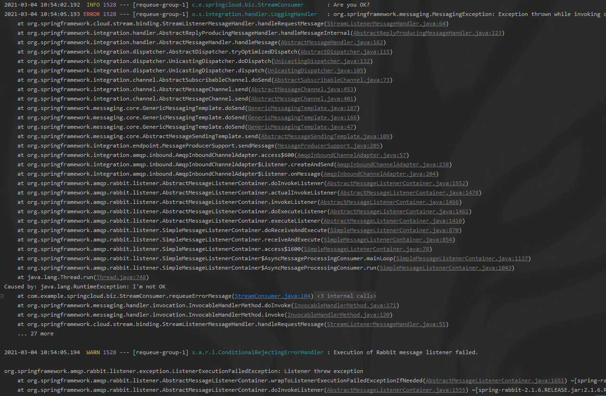

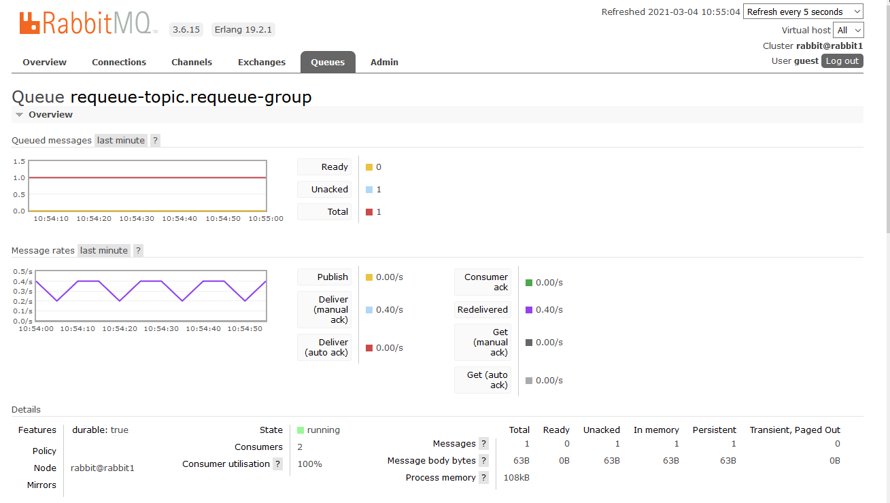


## 2-18 借助死信队列实现异常处理

- 死信队列介绍
- 使用 rabbitmq-plugins enable 命令开启RabbitMQ插件
  - rabbitmq_shovel
  - rabbitmq_shovel_management
- 创建Producer和Consumer, 配置死信队列
- 启动应用, 查看RabbitMQ界面的死信队列
- 死信队列消息重新消费

### 死信队列 (DLQ)

(1) &nbsp; 介绍
- 死信队列：DLX，dead-letter-exchange
- 利用DLX，当消息在一个队列中变成死信 (dead message) 之后，它能被重新publish到另一个Exchange，这个Exchange就是DLX

(2) &nbsp; 消息变成死信有以下几种情况
- 消息被拒绝(basic.reject / basic.nack)，并且requeue = false
- 消息TTL过期
- 队列达到最大长度

(3) &nbsp; 死信处理过程
- DLX也是一个正常的Exchange，和一般的Exchange没有区别，它能在任何的队列上被指定，实际上就是设置某个队列的属性。
- 当这个队列中有死信时，RabbitMQ就会自动的将这个消息重新发布到设置的Exchange上去，进而被路由到另一个队列。
- 可以监听这个队列中的消息做相应的处理。

(4) &nbsp; 

### 开启插件

基本默认已经安装，只要开启就可以

(1) &nbsp; 进入容器, 查看插件状态

```shell script
[root@k8s-master1 ~]# docker exec -it myrabbit1 bash
root@rabbit1:/# rabbitmq-plugins list |grep 'rabbitmq_shovel'
[  ] rabbitmq_shovel                   3.6.15
[  ] rabbitmq_shovel_management        3.6.15
```

(2) &nbsp; 开启插件
```shell script
root@rabbit1:/# rabbitmq-plugins enable rabbitmq_shovel
The following plugins have been enabled:
  rabbitmq_shovel

Applying plugin configuration to rabbit@rabbit1... started 1 plugin.

root@rabbit1:/# rabbitmq-plugins enable rabbitmq_shovel_management 
The following plugins have been enabled:
  rabbitmq_shovel_management

Applying plugin configuration to rabbit@rabbit1... started 1 plugin.
```

(3) &nbsp; 确认是否开启插件
```shell script
root@rabbit1:/# rabbitmq-plugins list |grep 'rabbitmq_shovel'
[E*] rabbitmq_shovel                   3.6.15
[E*] rabbitmq_shovel_management        3.6.15
```

### 主题
com.example.springcloud.topic.DlqTopic
```java
public interface DlqTopic {

	/**
	 * Input channel name.
	 */
	String INPUT = "dlq-consumer";

	/**
	 * Output channel name.
	 */
	String OUTPUT = "dlq-producer";

	/**
	 * input=消费者
	 */
	@Input(INPUT)
	SubscribableChannel input();

	/**
	 * output=生产者
	 */
	@Output(OUTPUT)
	MessageChannel output();

}
```

### Producer

com.example.springcloud.biz.controller.DemoController
```java
@PostMapping("dlq")
public void sendMessageToDlq(@RequestParam(value = "body") String body) {
    MessageBean msg = new MessageBean();
    msg.setPayload(body);
    dlqTopicProducer.output().send(MessageBuilder.withPayload(msg).build());
}
```

### Consumer

com.example.springcloud.biz.StreamConsumer
```java
@StreamListener(DlqTopic.INPUT)
public void consumeDlqMessage(MessageBean bean) {
    log.info("Dlq - 你还好吗?");
    if (count.incrementAndGet() % 3 == 0) {
        log.info("Dlq - 很好，谢谢。你呢？");
    } else {
        log.info("Dlq - 你怎么回事啊?");
        throw new RuntimeException("我不好~");
    }
}
```

### 死信队列配置
```yaml
spring:
  cloud:
    stream:
      bindings:
        dlq-consumer:
          destination: dlq-topic
          consumer:
            max-attempts: 2
          group: dlq-group
        dlq-producer:
          destination: dlq-topic
      rabbit:
        bindings:
          dlq-consumer:
            consumer:
              auto-bind-dlq: true # 开启死信队列（默认 topic.dlq）
                                  # 参数还有很多，比如：指定某个Queue 而不是使用自动创建的等等...
```

### 测试环节

- 启动服务
  - StreamApplication (63000) :63000/
  - 访问网页 http://192.168.8.240:15672/#/queues
  
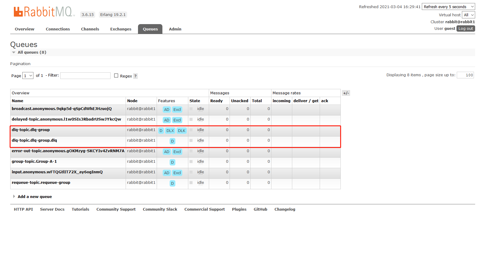

- PostMan
  - POST localhost:63000/dlq
  
控制台打印
```text
2021-03-04 16:31:55.013  INFO 22640 --- [io-63000-exec-2] o.s.a.r.c.CachingConnectionFactory       : Attempting to connect to: [192.168.8.240:5672]
2021-03-04 16:31:55.022  INFO 22640 --- [io-63000-exec-2] o.s.a.r.c.CachingConnectionFactory       : Created new connection: rabbitConnectionFactory.publisher#1d503bab:0/SimpleConnection@ce71016 [delegate=amqp://guest@192.168.8.240:5672/, localPort= 2986]
2021-03-04 16:31:55.025  INFO 22640 --- [io-63000-exec-2] o.s.amqp.rabbit.core.RabbitAdmin         : Auto-declaring a non-durable, auto-delete, or exclusive Queue (input.anonymous.wFTQGtlIT72X_ay6ogInmQ) durable:false, auto-delete:true, exclusive:true. It will be redeclared if the broker stops and is restarted while the connection factory is alive, but all messages will be lost.
2021-03-04 16:31:55.025  INFO 22640 --- [io-63000-exec-2] o.s.amqp.rabbit.core.RabbitAdmin         : Auto-declaring a non-durable, auto-delete, or exclusive Queue (broadcast.anonymous.9qkp5d-qSpCdWhEJHzuojQ) durable:false, auto-delete:true, exclusive:true. It will be redeclared if the broker stops and is restarted while the connection factory is alive, but all messages will be lost.
2021-03-04 16:31:55.025  INFO 22640 --- [io-63000-exec-2] o.s.amqp.rabbit.core.RabbitAdmin         : Auto-declaring a non-durable, auto-delete, or exclusive Queue (delayed-topic.anonymous.l1w0SIs3RbadrUSwJYkcQw) durable:false, auto-delete:true, exclusive:true. It will be redeclared if the broker stops and is restarted while the connection factory is alive, but all messages will be lost.
2021-03-04 16:31:55.025  INFO 22640 --- [io-63000-exec-2] o.s.amqp.rabbit.core.RabbitAdmin         : Auto-declaring a non-durable, auto-delete, or exclusive Queue (error-out-topic.anonymous.gOKMzyg-SKCYIv4ZvRNM7A) durable:false, auto-delete:true, exclusive:true. It will be redeclared if the broker stops and is restarted while the connection factory is alive, but all messages will be lost.
2021-03-04 16:31:55.094  INFO 22640 --- [pic.dlq-group-1] c.e.springcloud.biz.StreamConsumer       : Dlq - 你还好吗?
2021-03-04 16:31:55.094  INFO 22640 --- [pic.dlq-group-1] c.e.springcloud.biz.StreamConsumer       : Dlq - 你怎么回事啊?
2021-03-04 16:31:56.097  INFO 22640 --- [pic.dlq-group-1] c.e.springcloud.biz.StreamConsumer       : Dlq - 你还好吗?
2021-03-04 16:31:56.097  INFO 22640 --- [pic.dlq-group-1] c.e.springcloud.biz.StreamConsumer       : Dlq - 很好，谢谢。你呢？
```

- 再次请求
  - POST localhost:63000/dlq
  
控制台打印
```text
2021-03-04 16:33:32.370  INFO 22640 --- [pic.dlq-group-1] c.e.springcloud.biz.StreamConsumer       : Dlq - 你还好吗?
2021-03-04 16:33:32.371  INFO 22640 --- [pic.dlq-group-1] c.e.springcloud.biz.StreamConsumer       : Dlq - 你怎么回事啊?
2021-03-04 16:33:33.372  INFO 22640 --- [pic.dlq-group-1] c.e.springcloud.biz.StreamConsumer       : Dlq - 你还好吗?
2021-03-04 16:33:33.372  INFO 22640 --- [pic.dlq-group-1] c.e.springcloud.biz.StreamConsumer       : Dlq - 你怎么回事啊?
2021-03-04 16:33:33.375 ERROR 22640 --- [pic.dlq-group-1] o.s.integration.handler.LoggingHandler   : org.springframework.messaging.MessagingException: Exception thrown while invoking com.example.springcloud.biz.StreamConsumer#consumeDlqMessage[1 args]; nested exception is java.lang.RuntimeException: 我不好~, failedMessage=GenericMessage [payload=byte[63], headers={amqp_receivedDeliveryMode=PERSISTENT, amqp_receivedExchange=dlq-topic, amqp_deliveryTag=2, deliveryAttempt=2, amqp_consumerQueue=dlq-topic.dlq-group, amqp_redelivered=false, amqp_receivedRoutingKey=dlq-topic, amqp_timestamp=Thu Mar 04 16:33:32 CST 2021, amqp_messageId=a3b4012e-4060-12f7-a022-7f640dbf2a58, id=60e3aeda-c236-79b1-c100-fc3ff6a8d540, amqp_consumerTag=amq.ctag-kGeRaKUKk_7lJjOYrlTIeA, contentType=application/json, timestamp=1614846812370}]
	at org.springframework.cloud.stream.binding.StreamListenerMessageHandler.handleRequestMessage(StreamListenerMessageHandler.java:64)
    ...
Caused by: java.lang.RuntimeException: 我不好~
	at com.example.springcloud.biz.StreamConsumer.consumeDlqMessage(StreamConsumer.java:121) ~[classes/:na]
    ...
```

会发现这次就抛出异常了.

然后在查看页面, 会发现 Queue dlq-topic.dlq-group.dlq 已经有变化了

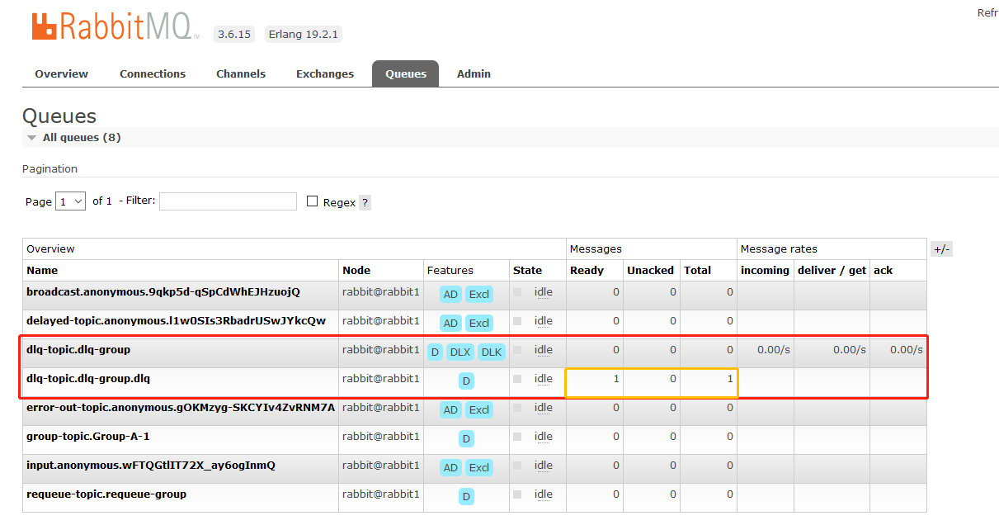

将这死信队列里面的消息, 重新激活消费, 可以复制Queue里面的名称进行重新激活消费

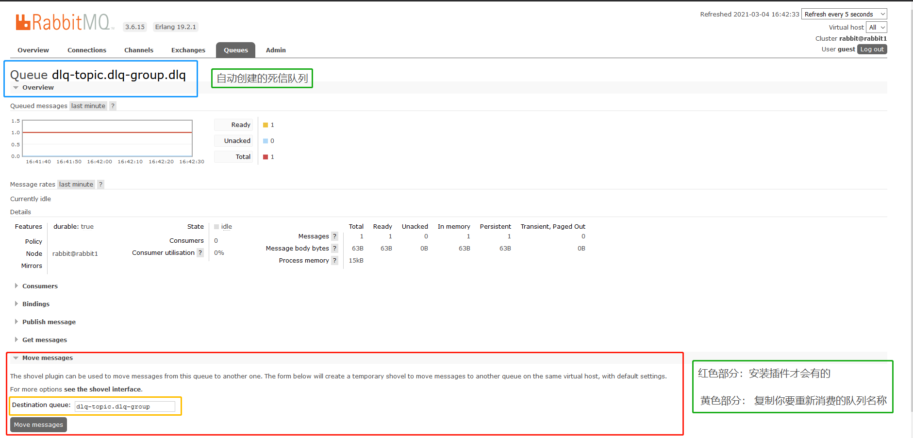

点击 Move Message 后控制台会打印正常消息

```text
2021-03-04 17:29:42.034  INFO 22640 --- [pic.dlq-group-1] c.e.springcloud.biz.StreamConsumer       : Dlq - 你还好吗?
2021-03-04 17:29:42.038  INFO 22640 --- [pic.dlq-group-1] c.e.springcloud.biz.StreamConsumer       : Dlq - 很好，谢谢。你呢？
```

Queue dlq-topic.dlq-group.dlq 的总数也归零, 证明消费了！


## 2-19 消息驱动中的降级和接口升版

- 借助spring-integration实现Fallback逻辑
- Consumer升级版的玩法

(1) &nbsp; 主题
```java
public interface FallbackTopic {

	/**
	 * Input channel name.
	 */
	String INPUT = "fallback-consumer";

	/**
	 * Output channel name.
	 */
	String OUTPUT = "fallback-producer";

	/**
	 * input=消费者
	 */
	@Input(INPUT)
	SubscribableChannel input();

	/**
	 * output=生产者
	 */
	@Output(OUTPUT)
	MessageChannel output();

}
```

(2) &nbsp; 生产者
```java
@PostMapping("fallback")
public void sendMessageToFallback(
        @RequestParam(value = "body") String body,
        @RequestParam(value = "version", defaultValue = "1.0") String version) {

    MessageBean msg = new MessageBean();
    msg.setPayload(body);

    fallbackTopicProducer.output().send(
            MessageBuilder.withPayload(msg)
                    .setHeader("version", version)
                    .build()
    );
}
```

(3) &nbsp; 消费者
```java
/**
 * Fallback + 升级版本
 * @param bean
 * @param version
 */
@StreamListener(FallbackTopic.INPUT)
public void goodbyeBadGuy(MessageBean bean,
                          @Header("version") String version) {
    log.info("Fallback - 你还好吗?");

    if ("1.0".equalsIgnoreCase(version)) {
        log.info("Fallback - 很好，谢谢。你呢");

    } else if ("2.0".equalsIgnoreCase(version)) {
        log.info("Fallback - 不支持的版本");
        throw new RuntimeException("我不好");
    } else {
        log.info("Fallback - 版本={}", version);
    }
}

/**
 * 降级流程
 *
 * input channel -> fallback-topic.fallback-group.errors
 *
 * 对应 application.yml 里面参数
 *
 * 如果出现异常和重试次数达到一定就会跳到这个方法
 * 
 * @param message
 */
@ServiceActivator(inputChannel = "fallback-topic.fallback-group.errors")
public void fallback(Message<?> message) {
    log.info("fallback - 已回退");
    // 可以写自己逻辑, 或者流程~ 
}
```

(4) &nbsp; 配置
```yaml
# Fallback配置
# input channel -> fallback-topic.fallback-group.errors
spring:
  cloud:
    stream:
      bindings:
        fallback-consumer:
          destination: fallback-topic
          consumer:
            max-attempts: 2
          group: fallback-group
        fallback-producer:
          destination: fallback-topic
```

(5) &nbsp; 测试

第一次请求
```text
POST localhost:63000/fallback

body:欢迎关注：https://blog.csdn.net/eddielee9217
version:1.0

2021-03-05 15:39:02.824  INFO 15472 --- [allback-group-1] c.e.springcloud.biz.StreamConsumer       : Fallback - 你还好吗?
2021-03-05 15:39:02.824  INFO 15472 --- [allback-group-1] c.e.springcloud.biz.StreamConsumer       : Fallback - 很好，谢谢。你呢
```

第二次请求
```text
POST localhost:63000/fallback

body:欢迎关注：https://blog.csdn.net/eddielee9217
version:2.0

2021-03-05 15:39:13.131  INFO 15472 --- [allback-group-1] c.e.springcloud.biz.StreamConsumer       : Fallback - 你还好吗?
2021-03-05 15:39:13.131  INFO 15472 --- [allback-group-1] c.e.springcloud.biz.StreamConsumer       : Fallback - 不支持的版本
2021-03-05 15:39:14.135  INFO 15472 --- [allback-group-1] c.e.springcloud.biz.StreamConsumer       : Fallback - 你还好吗?
2021-03-05 15:39:14.135  INFO 15472 --- [allback-group-1] c.e.springcloud.biz.StreamConsumer       : Fallback - 不支持的版本
2021-03-05 15:39:14.139  INFO 15472 --- [allback-group-1] c.e.springcloud.biz.StreamConsumer       : fallback - 已回退
```