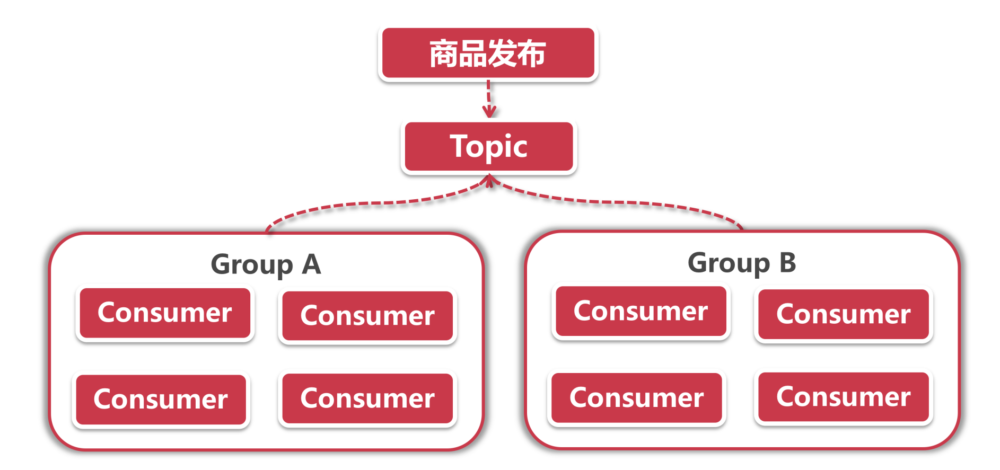

[TOC]

# 前言

## 2-4 Stream快速入门-集成MQ消费

- 创建 stream-sample 项目, 引入依赖
- 创建监听器 (声明和绑定信道)
- 从RabbitMQ触发消息

### RabbitMQ 界面操作

1. http://192.168.8.240:15672 (guest/guest)
1. 查看 Queue input.anonymous.Z5LyfIlEQtqw3hcJTAhHfA
1. 发送消息
	- 下方 Publish message
	- Payload: 自定义内容
	- 点击按钮 Publish message
	- IDEA控制台就会提示:"message consumed successfully, payload=自定义内容"
	
[Docker部署RabbitMQ](https://blog.eddilee.cn/archives/docker%E9%83%A8%E7%BD%B2rabbitmq%E9%9B%86%E7%BE%A4)

## 2-8 基于发布订阅实现广播功能

- 创建消息生产者Producer服务, 配置消息主题
- 启动多个消费者Consumer节点测试消息广播
- RabbitMQ界面查看广播组（Exchanges）

### 自定义主题 (Topic)

com.example.springcloud.topic.MyTopic
```java
public interface MyTopic {

	/**
	 * Input channel name.
	 */
	String INPUT = "myTopic-consumer";

	/**
	 * Output channel name.
	 */
	String OUTPUT = "myTopic-producer";

	/**
	 * input=消费者
	 */
	@Input(INPUT)
	SubscribableChannel input();

	/**
	 * output=生产者
	 */
	@Output(OUTPUT)
	MessageChannel output();

}
```

### 添加消费者

com.example.springcloud.biz.StreamConsumer
```java
@Slf4j
// 绑定信道
@EnableBinding(
        value = {
                Sink.class,
				MyTopic.class
        }
)
public class StreamConsumer {

    @StreamListener(Sink.INPUT)
	public void consume(Object payload) {
		log.info("message consumed successfully, payload={}", payload);
	}

	@StreamListener(MyTopic.INPUT)
	public void consumeMyMessage(Object payload) {
		log.info("my message consumed successfully, payload={}", payload);
	}

}
```

### 使用配置文件, 绑定生产者和消费者的通道

application.yml
```yaml
# 绑定 Channel 到 broadcast
spring:
  cloud:
    stream:
      bindings:
        myTopic-consumer:  # 消费者绑定
          destination: broadcast # rabbitMq界面显示 Exchange
        myTopic-producer:  # 生产者绑定
          destination: broadcast
```

### 启动与测试

（1） 按不同端口启动
- StreamApplication (63000) :63000/
- StreamApplication (63001) :63001/

（2） Postman (demo - 最简单的生产者消费者)
- POST localhost:63000/send
- Body (x-www-form-urfencoded)
  - body:hello broadcast
- 63000、630001 控制台打印：
  - my message consumed successfully, payload=hello broadcast
  
（3） RabbitMQ WEB
- 打开 http://192.168.8.240:15672
- 查看顶部 Exchanges 下面是否存在 "broadcast"
- 查看 Bindings (每一个Queues都对应后台一个监听队列)
  - broadcast.anonymous.DIILcrP3SvaGEUv6dfiAqQ
  - broadcast.anonymous.UnlUchdPQnaavW5uBIQjEA
- 查看顶部 Queues 是否存在对应 Bindings
  - 点击 broadcast.anonymous.DIILcrP3SvaGEUv6dfiAqQ 
  - 进入后, 点击 Publish message 输入"queues test"
  - 返回 IDEA控制台 就会显示该条 Message
    - my message consumed successfully, payload=queues test


## 2-10 消费组和消息分区详解

### 消费组

前面我们接触的都是广播场景，话说这个广播模式简直就是个围观模式，所有订阅相同主题的消费者都眼巴巴看着生产者发布的消息，一个消息在所有节点都要被消费一遍。如果我只想挑一个节点来消费消息，而且又不能只逮着一只羊来薅羊毛，必须利用负载均衡来分发请求。这个Stream能不能办到呢？
这不就是单播模式吗，那自然不在话下，Stream里的消费组就是专门解决这个问题的。让我们来用一个案例说明它的工作模式：



在上面这个例子中，“商品发布”就是一个消息，它被放到了对应的消息队列中，有两拨人马同时盯着这个Topic，这两拨人马各自组成了一个Group，每次有新消息到来的时候，每个Group就派出一个代表去响应，而且是从这个Group中轮流挑选代表（负载均衡），这里的Group也就是我们说的消费者。
在Stream里配置一个消费组非常简单，下一小节我就带大家去做一个Demo。在这里我就先小剧透一点内容好了：

spring.cloud.stream.bindings.group-producer.group=Group-A

看破不说破，这里面是什么含义，且听下节分享。

### 消费分区

消费分区消费组，傻傻分不清楚。这两个名字听起来很像，其实并不是一码事，消费组相当于是每组派一个代表去办事儿，而消费分区相当于是专事专办，也就是说，所有消息都会根据分区Key进行划分，带有相同Key的消息只能被同一个消费者处理。
我们来看下面的消息分区例子：


消息分区有一个预定义的分区Key，它是一个SpEL表达式（想想前面哪一章节讲过SpEL？提示换一下，Key Resolver）。我们需要在配置文件中指定分区的总个数N，Stream就会为我们创建N个分区，这里面每个分区就是一个Queue（可以在RabbitMQ管理界面中看到所有的分区队列）。
当商品发布的消息被生产者发布时，Stream会计算得出分区Key，从而决定这个消息应该加入到哪个Queue里面。在这个过程中，每个消费组/消费者仅会连接到一个Queue，这个Queue中对应的消息只能被特定的消费组/消费者来处理。
