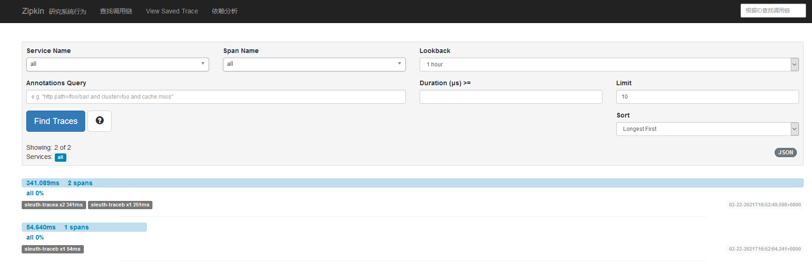

[TOC]

# 前言

## 1-9 搭建Zipkin服务端

- 搭建Zipkin服务端
    - pom.xml
    - 创建 ZipkinApplication 启动类
    - 创建 application.yml 配置文件
    - 访问 [Zipkin WEB UI](http://localhost:62100/zipkin/)

> 如没有特殊要求可以直接使用官方下载的 Zipkin.jar, 直接运行 java -jar Zipkin.jar

## 1-10 Sleuth集成Zipkin实例

- sleuth-traceA 与 sleuth-traceB 集成 Zipkin
- 从Zipkin Dashboard搜索调用链路的时间维度数据

### 添加依赖与配置

pom.xml
```xml
<!-- Zipkin -->
<dependency>
    <groupId>org.springframework.cloud</groupId>
    <artifactId>spring-cloud-starter-zipkin</artifactId>
</dependency>
```

application.yml
```yaml
# 集成 Zipkin 配合 Sleuth 采样使用
spring:
  zipkin:
    base-url: http://localhost:62100 # Zipkin的地址
  sleuth:
    sampler:
      probability: 1 # 1 = 100% 如若采样 50% 就是 0.5
```

### 启动顺序
- EurekaServerApplication :20000/
- SleuthTrace2Application :62001/
- SleuthTrace1Application :62000/
- ZipkinApplication :62100/

### 测试

GET http://localhost:62001/traceB
```xml
16:52:04.266  INFO [-,16f36d5522d2aeb5,16f36d5522d2aeb5,true] 19076 --- [io-62001-exec-1] ---------Trace.B
16:52:04.731  INFO [-,,,] 19076 --- [Sender@f017dd0}] Flipping property: localhost.ribbon.ActiveConnectionsLimit to use NEXT property: niws.loadbalancer.availabilityFilteringRule.activeConnectionsLimit = 2147483647
16:52:04.758  INFO [-,,,] 19076 --- [Sender@f017dd0}] Shutdown hook installed for: NFLoadBalancer-PingTimer-localhost
16:52:04.759  INFO [-,,,] 19076 --- [Sender@f017dd0}] Client: localhost instantiated a LoadBalancer: DynamicServerListLoadBalancer:{NFLoadBalancer:name=localhost,current list of Servers=[],Load balancer stats=Zone stats: {},Server stats: []}ServerList:null
16:52:04.766  INFO [-,,,] 19076 --- [Sender@f017dd0}] Using serverListUpdater PollingServerListUpdater
16:52:04.769  INFO [-,,,] 19076 --- [Sender@f017dd0}] DynamicServerListLoadBalancer for client localhost initialized: DynamicServerListLoadBalancer:{NFLoadBalancer:name=localhost,current list of Servers=[],Load balancer stats=Zone stats: {},Server stats: []}ServerList:org.springframework.cloud.netflix.ribbon.eureka.DomainExtractingServerList@3fab535a

分析：
[-,16f36d5522d2aeb5,16f36d5522d2aeb5,true]  true 是因为添加了 ZipKin 而生效
```

GET http://localhost:62000/traceA

SleuthTrace2Application :62001/
```xml
16:52:49.900  INFO [-,7807225fc9569da6,c1c51fc3f36acdde,true] 19076 --- [io-62001-exec-4] ---------Trace.B
```

SleuthTrace1Application :62000/
```xml
16:52:49.629  INFO [-,7807225fc9569da6,7807225fc9569da6,true] 936 --- [io-62000-exec-5] -------Trace A
16:52:49.813  INFO [-,7807225fc9569da6,c1c51fc3f36acdde,true] 936 --- [io-62000-exec-5] Flipping property: sleuth-traceB.ribbon.ActiveConnectionsLimit to use NEXT property: niws.loadbalancer.availabilityFilteringRule.activeConnectionsLimit = 2147483647
16:52:49.840  INFO [-,7807225fc9569da6,c1c51fc3f36acdde,true] 936 --- [io-62000-exec-5] Shutdown hook installed for: NFLoadBalancer-PingTimer-sleuth-traceB
16:52:49.841  INFO [-,7807225fc9569da6,c1c51fc3f36acdde,true] 936 --- [io-62000-exec-5] Client: sleuth-traceB instantiated a LoadBalancer: DynamicServerListLoadBalancer:{NFLoadBalancer:name=sleuth-traceB,current list of Servers=[],Load balancer stats=Zone stats: {},Server stats: []}ServerList:null
16:52:49.846  INFO [-,7807225fc9569da6,c1c51fc3f36acdde,true] 936 --- [io-62000-exec-5] Using serverListUpdater PollingServerListUpdater
16:52:49.869  INFO [-,7807225fc9569da6,c1c51fc3f36acdde,true] 936 --- [io-62000-exec-5] Flipping property: sleuth-traceB.ribbon.ActiveConnectionsLimit to use NEXT property: niws.loadbalancer.availabilityFilteringRule.activeConnectionsLimit = 2147483647
16:52:49.871  INFO [-,7807225fc9569da6,c1c51fc3f36acdde,true] 936 --- [io-62000-exec-5] DynamicServerListLoadBalancer for client sleuth-traceB initialized: DynamicServerListLoadBalancer:{NFLoadBalancer:name=sleuth-traceB,current list of Servers=[localhost:62001],Load balancer stats=Zone stats: {defaultzone=[Zone:defaultzone;	Instance count:1;	Active connections count: 0;	Circuit breaker tripped count: 0;	Active connections per server: 0.0;]
},Server stats: [[Server:localhost:62001;	Zone:defaultZone;	Total Requests:0;	Successive connection failure:0;	Total blackout seconds:0;	Last connection made:Thu Jan 01 08:00:00 CST 1970;	First connection made: Thu Jan 01 08:00:00 CST 1970;	Active Connections:0;	total failure count in last (1000) msecs:0;	average resp time:0.0;	90 percentile resp time:0.0;	95 percentile resp time:0.0;	min resp time:0.0;	max resp time:0.0;	stddev resp time:0.0]
]}ServerList:org.springframework.cloud.netflix.ribbon.eureka.DomainExtractingServerList@4f296c1d
16:52:50.851  INFO [-,,,] 936 --- [erListUpdater-0] Flipping property: sleuth-traceB.ribbon.ActiveConnectionsLimit to use NEXT property: niws.loadbalancer.availabilityFilteringRule.activeConnectionsLimit = 2147483647
16:52:50.907  INFO [-,,,] 936 --- [Sender@9263c54}] Flipping property: localhost.ribbon.ActiveConnectionsLimit to use NEXT property: niws.loadbalancer.availabilityFilteringRule.activeConnectionsLimit = 2147483647
16:52:50.909  INFO [-,,,] 936 --- [Sender@9263c54}] Shutdown hook installed for: NFLoadBalancer-PingTimer-localhost
16:52:50.910  INFO [-,,,] 936 --- [Sender@9263c54}] Client: localhost instantiated a LoadBalancer: DynamicServerListLoadBalancer:{NFLoadBalancer:name=localhost,current list of Servers=[],Load balancer stats=Zone stats: {},Server stats: []}ServerList:null
16:52:50.911  INFO [-,,,] 936 --- [Sender@9263c54}] Using serverListUpdater PollingServerListUpdater
16:52:50.912  INFO [-,,,] 936 --- [Sender@9263c54}] DynamicServerListLoadBalancer for client localhost initialized: DynamicServerListLoadBalancer:{NFLoadBalancer:name=localhost,current list of Servers=[],Load balancer stats=Zone stats: {},Server stats: []}ServerList:org.springframework.cloud.netflix.ribbon.eureka.DomainExtractingServerList@34f797a
16:56:22.306  INFO [-,,,] 936 --- [trap-executor-0] Resolving eureka endpoints via configuration
```

parentId & traceId: 7807225fc9569da6 是相同的, 在两个服务, 同一条链路 <br>
spanId: c1c51fc3f36acdde


## ZipKin Web UI




<br>

[GitHub](https://github.com/eddie-code) <br>
[博客园](https://www.cnblogs.com/EddieBlog) <br>
[CSDN](https://blog.csdn.net/eddielee9217) <br>
[自建博客](https://blog.eddilee.cn/s/about) <br>